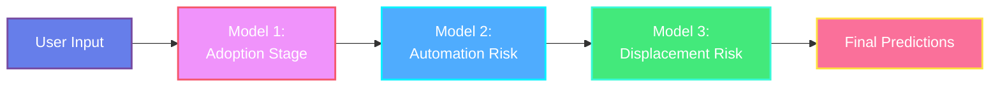

<div align="center">

# 🤖 AI Impact Job Analyzer

### *Predicting the Future of Work in the Age of AI*

[](https://streamlit.io)
[](https://python.org)
[](https://catboost.ai)
[](https://plotly.com)

**A cutting-edge machine learning application that analyzes and predicts AI's impact on job roles across industries**

[🚀 Live Demo](https://global-ai-job-impact-yabjgxj49kuclqvpjme2h6.streamlit.app) • [📊 Notebooks](./notebooks) • [📖 Documentation](#documentation)

---

</div>

## 📌 About the Project

The **AI Impact Job Analyzer** is an intelligent web application that leverages advanced machine learning to predict how artificial intelligence will impact various job roles. Built with Streamlit and powered by CatBoost models, this tool analyzes job characteristics to provide actionable insights about automation risk, job displacement probability, and industry AI adoption stages.

### ✨ Key Features

- 🎯 **Triple Prediction System**: Predicts industry AI adoption stage, automation risk score, and job displacement risk
- 📊 **Interactive Visualizations**: Real-time gauge charts and dynamic risk assessments
- 🎨 **Premium UI/UX**: Modern gradient design with glassmorphism effects
- 🔮 **Instant Analysis**: Get predictions in milliseconds
- 💡 **Smart Recommendations**: Personalized career advice based on AI impact analysis
- 📱 **Responsive Design**: Works seamlessly on desktop and mobile

---

## 🎯 What It Predicts

| Prediction | Type | Output |
|------------|------|--------|
| **Industry AI Adoption Stage** | Classification | Emerging / Growing / Mature |
| **Automation Risk Score** | Regression | 0% - 100% |
| **AI Job Displacement Risk** | Classification | Low / Medium / High |

---

## 🚀 Quick Start

### Prerequisites

- Python 3.8+
- pip package manager

### Installation

```bash
# Clone the repository
git clone https://github.com/singhan14/global-ai-job-impact.git
cd global-ai-job-impact

# Install dependencies
pip install -r requirements.txt

# Run the app
streamlit run app.py
```

The app will open automatically at `http://localhost:8501` 🎉

---

## 📊 Model Architecture

Our cascading prediction pipeline employs three specialized CatBoost models:



### Model Performance

| Model | Type | Metric | Score |
|-------|------|--------|-------|
| **Industry AI Adoption** | Multi-class Classification | Accuracy | **100%** ✨ |
| **Automation Risk** | Regression | R² Score | **0.88** 📈 |
| **Automation Risk** | Regression | RMSE | **0.088** 🎯 |
| **Job Displacement** | Multi-class Classification | Accuracy | **33%** ⚖️ |

---

## 📥 Input Features

The model analyzes **8 key job characteristics**:

| Feature | Type | Description | Examples |
|---------|------|-------------|----------|
| 📅 **Posting Year** | Numeric | Year of job posting | 2010-2030 |
| 🌍 **City** | Categorical | Job location | Bangalore, London, Singapore, Tokyo |
| 🏢 **Company Size** | Categorical | Organization scale | Startup, Small, Medium, Large, Enterprise |
| 🏭 **Industry** | Categorical | Business sector | Tech, Finance, Healthcare, Education |
| 💼 **Job Title** | Categorical | Role designation | ML Engineer, Data Scientist, Analyst |
| 📈 **Seniority Level** | Categorical | Experience tier | Intern, Junior, Mid, Senior, Lead, Executive |
| 🧠 **AI Intensity Score** | Numeric | AI involvement in role | 0.0 - 1.0 |
| 💰 **Salary (USD)** | Numeric | Annual compensation | $10,000 - $500,000 |

---

## 📁 Project Structure

```
global-ai-job-impact/
├── 📱 app.py                              # Main Streamlit application
├── 🔧 train_models.py                     # Model training script
├── 📊 ai_impact_jobs_2010_2025(2).csv    # Training dataset (5,000 jobs)
├── 🤖 model_adoption.pkl                  # Industry AI adoption classifier
├── 🤖 model_automation.pkl                # Automation risk regressor
├── 🤖 model_displacement.pkl              # Job displacement classifier
├── 📋 feature_columns.pkl                 # Feature column names
├── 📦 requirements.txt                    # Python dependencies
├── 📖 README.md                           # Project documentation
├── 🚀 DEPLOYMENT.md                       # Deployment guide
├── 🚫 .gitignore                          # Git ignore rules
└── 📓 notebooks/                          # Jupyter notebooks
    ├── Modelling.ipynb                    # Model development
    └── Complete_EDA_Analysis.ipynb        # Exploratory data analysis
```

---

## 🎮 How to Use

### 1️⃣ Input Job Parameters

Enter the job details in the sidebar:
- Select year, location, and company size
- Choose industry and job title
- Set seniority level
- Adjust AI intensity score (0.0 = no AI, 1.0 = fully AI-driven)
- Enter expected salary

### 2️⃣ Generate Predictions

Click the **"🚀 Predict"** button

### 3️⃣ Analyze Results

View comprehensive insights:
- **Industry AI Adoption Stage**: See where your industry stands
- **Automation Risk Score**: Understand job automation probability
- **Job Displacement Risk**: Assess AI displacement likelihood
- **Interactive Charts**: Explore visual risk assessments
- **Smart Recommendations**: Get personalized career guidance

---

## 🛠️ Technologies Used

| Category | Technologies |
|----------|-------------|
| **Frontend** | Streamlit, HTML/CSS |
| **ML Framework** | CatBoost, Scikit-learn |
| **Data Processing** | Pandas, NumPy |
| **Visualizations** | Plotly |
| **Deployment** | Streamlit Cloud, GitHub |

---

## 📈 Dataset

The model is trained on a comprehensive dataset of **5,000 job postings** from 2010-2025, featuring:

- 🌎 **8 Global Cities**: Bangalore, London, Singapore, Sydney, Tokyo, Nairobi, NYC, SF
- 🏭 **8 Industries**: Tech, Finance, Healthcare, Education, Manufacturing, Energy, Government, Retail
- 💼 **7 Job Roles**: ML Engineer, Data Scientist, Software Engineer, AI Researcher, Product Manager, Policy Analyst, Business Analyst
- 📊 **6 Seniority Levels**: Intern, Junior, Mid, Senior, Lead, Executive

---

## 🚀 Deployment

### Deploy to Streamlit Cloud

1. Visit [share.streamlit.io](https://share.streamlit.io)
2. Sign in with GitHub
3. Click **New app**
4. Configure:
   - Repository: `singhan14/global-ai-job-impact`
   - Branch: `main`
   - Main file: `app.py`
5. Click **Deploy!**

Your app will be live in minutes! 🎉

For detailed deployment instructions, see [DEPLOYMENT.md](./DEPLOYMENT.md).

---

## 📊 Sample Predictions

### Example 1: ML Engineer in Tech

**Input:**
- Year: 2025 | City: Bangalore | Industry: Tech
- Job: ML Engineer | Level: Mid | Salary: $80,000
- AI Intensity: 0.75

**Output:**
- **Adoption Stage**: Mature
- **Automation Risk**: 23.3%
- **Displacement Risk**: Medium

### Example 2: Policy Analyst in Education

**Input:**
- Year: 2025 | City: London | Industry: Education
- Job: Policy Analyst | Level: Senior | Salary: $65,000
- AI Intensity: 0.20

**Output:**
- **Adoption Stage**: Growing
- **Automation Risk**: 12.5%
- **Displacement Risk**: Low

---

## 🔄 Retraining Models

To retrain models with updated data:

```bash
# Update the CSV file with new data
# Then run:
python train_models.py
```

This will regenerate all `.pkl` model files with the latest data.

---

## 🤝 Contributing

We welcome contributions! Here's how you can help:

1. 🍴 Fork the repository
2. 🌿 Create a feature branch (`git checkout -b feature/AmazingFeature`)
3. 💾 Commit your changes (`git commit -m 'Add AmazingFeature'`)
4. 📤 Push to the branch (`git push origin feature/AmazingFeature`)
5. 🔀 Open a Pull Request

---

## 📸 Screenshots

<div align="center">

### Home Screen
*Interactive sidebar with job parameter inputs*

### Prediction Dashboard
*Real-time predictions with gauge charts and visualizations*

### Risk Analysis
*Detailed insights and personalized recommendations*

</div>

---

## 📝 License

This project is open source and available under the **MIT License**.

---

## 👥 Team

<div align="center">

### Created with ❤️ by

**Singhan • Ahan • Ojas • Rudranil**

*Indian Institute of Foreign Trade (IIFT)*

<br>

[](https://github.com/singhan14/global-ai-job-impact)
[](#)

</div>

---

## 🙏 Acknowledgments

- Dataset: AI Impact on Jobs (2010-2025)
- Built with [Streamlit](https://streamlit.io)
- ML powered by [CatBoost](https://catboost.ai)
- Visualizations by [Plotly](https://plotly.com)
- Inspired by the future of work research

---

<div align="center">

### ⭐ Star this repository if you find it helpful!

**[Report Bug](https://github.com/singhan14/global-ai-job-impact/issues) • [Request Feature](https://github.com/singhan14/global-ai-job-impact/issues)**

<br>

*Predicting the future of work, one job at a time* 🚀

</div>
